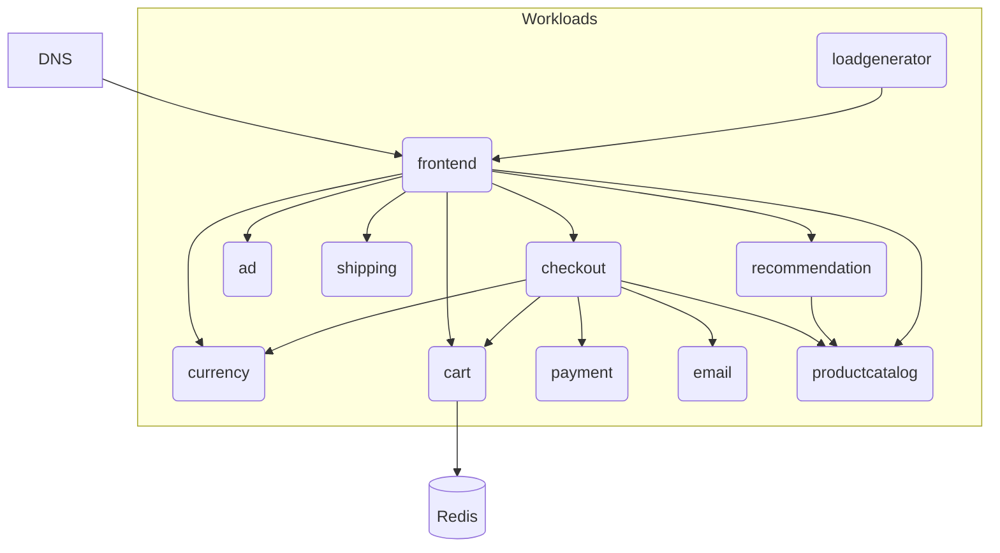

# OnlineBoutique

Deploy the [GoogleCloudPlatform/microservices-demo](https://github.com/GoogleCloudPlatform/microservices-demo) with Score:

- [`score-compose`](./score-compose.md)
- [`score-k8s`](./score-k8s.md)