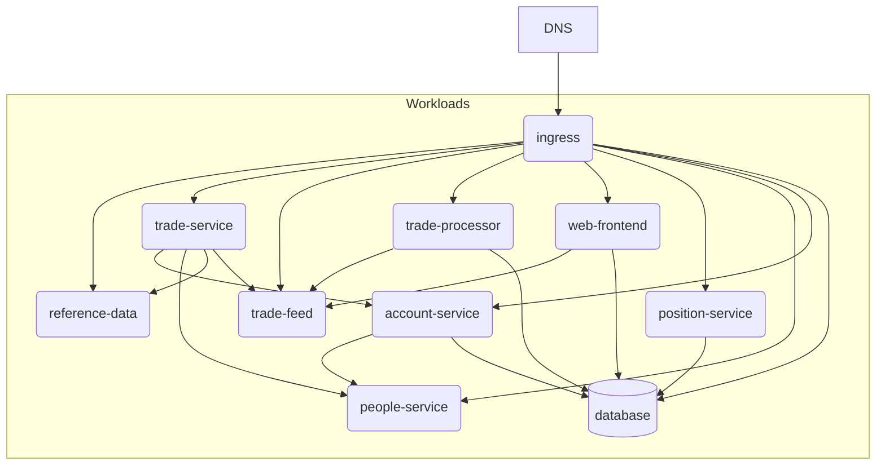

Deploy the [finos/traderX](https://github.com/finos/traderX) with Score (`score-compose` and `score-k8s`).



## Local deployment with Docker Compose

You need to be in the `samples/traderx` folder to run the following commands.

Deploy and test locally with Docker compose:
```bash
make compose-up
```

You can now browse http://localhost:8080.

## Local deployment with Kind cluster

Deploy and test locally with Kind cluster:
```bash
make kind-create-cluster

make k8s-up
```

You can now browse http://localhost:80.